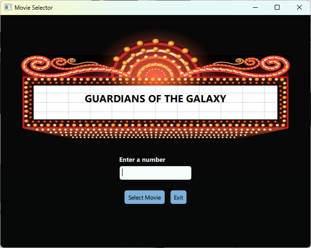
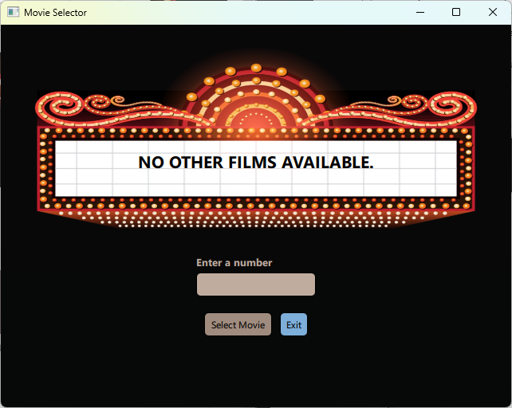

# Movie Selector

## Description
Movie Selector is a Qt Quick application designed to randomly select a movie from a list of movies (stored as a text file) based on numerical input provided by the user.

## Requirements
- Qt Creator
- Qt 6.4 or newer
- CMake 3.16 or newer

## Installation
1. Clone the repository: `git clone https://github.com/devol-ve/MovieSelector.git`
2. Open the project in Qt Creator.
3. Build and run the project.

## Usage

### Select a Movie

1. Enter a number into the text field.

2. Press Select Movie or hit Enter.
3. The program will then randomly select and display a movie from stack_even if the input is even or stack_odd if the input is odd. If either stack is empty the program will select the movie from the remaining stack.

If both stacks are empty the program will display a default message and it will no longer accept any input from the user.

To exit the program press Exit or hit Esc.

## Contributing
Pull requests are welcome. For major changes, please open an issue first to discuss what you would like to change.

## License
This project is licensed under the terms of the GNU General Public License v3.0. See the LICENSE file for details.